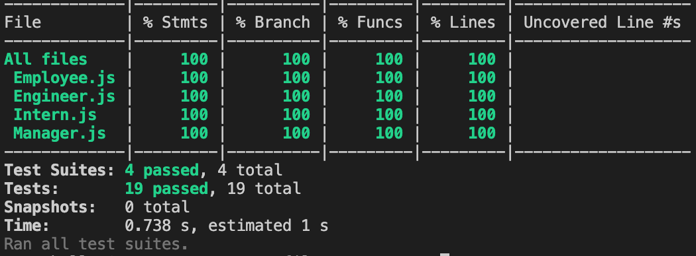
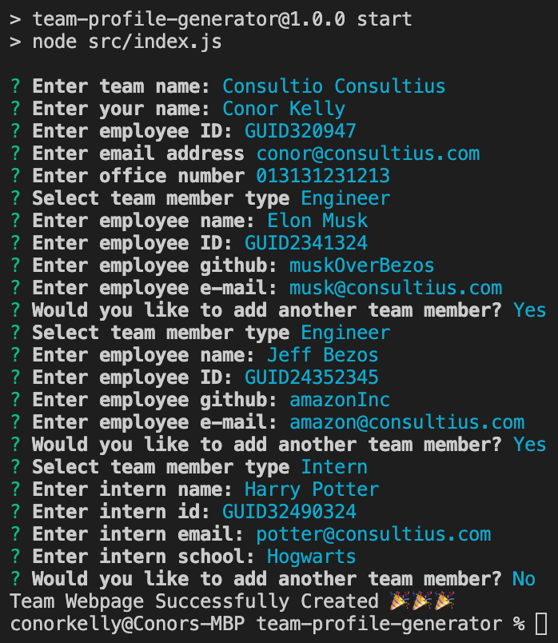
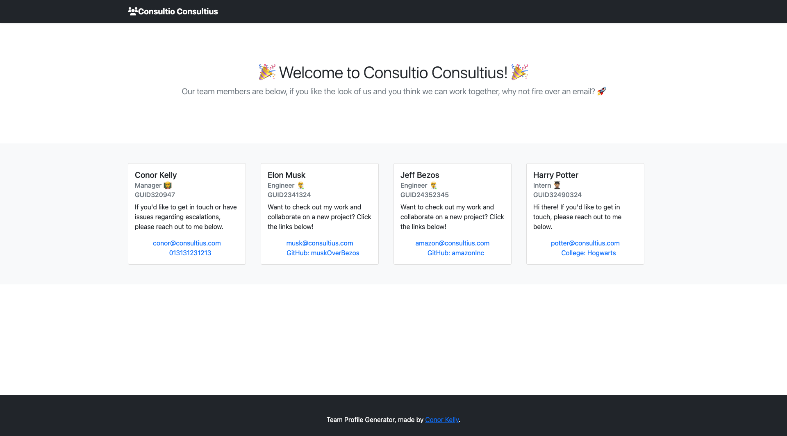

# Team Profile Generator

## About the project

This command line interface application is designed to allow managers to quickly generate a Team Profile webpage based on the different types of employees they want to add with their corresponding contact information.

## Table of Contents

- [Technologies Used](#technologiesused)
- [Link to Walkthrough](#linktowalkthrough)
- [Solution Overview](#solutionoverview)
- [Inquirer](#inquirer)
- [License](#screenshots)

## Technologies Used

- JavaScript
  - node.js
  - inquirer.js
  - jest.js (TDD)
- HTML 5
- CSS
  - BootStrap

## Link to Walkthrough

[Click here!](https://drive.google.com/drive/folders/1zaPQcu1q1uCcHMuSMjucVyZxd6Ms_L87?usp=sharing)

## Inquirer

Inquirer was installed to allow managers to respond to a list of predefined questions to capture employee data used to create the team member cards. An example of the question structure is below:

```javascript
const managerQuestion = [
  {
    type: "input",
    message: "Enter your name:",
    name: "name",
  },
  {
    type: "input",
    message: "Enter employee ID:",
    name: "id",
  },
  {
    type: "input",
    message: "Enter email address",
    name: "email",
  },
  {
    type: "input",
    message: "Enter office number",
    name: "officeNumber",
  },
];
```

The answers object were subsequently destructured in order to push the relevant data sets into the `teamMembers` array.

```javascript
if (employeeType == "Engineer") {
  const { name, id, email, github } = await inquirer.prompt(engineerQuestions);
  const engineer = new Engineer({ name, id, email, github });
  teamMembers.push(engineer);
}
```

## Test Driven Development

When creating the `Employee` class and subclasses, it was important they passed the relevant tests to ensure when used in the live application the data was being successfully captured and the class methods functioned as expected.

```javascript
describe("Employee", () => {
  test("should be an instance of Employee", () => {
    const expected = "Employee";
    const instance = new Employee("Employee");
    const actual = instance.getRole();

    expect(actual).toEqual(expected);
  });
```

All 19 passes across 4 test files successfully passed and thus severed their proposes in the application.



## Screenshots

As you will find in the [walkthrough](https://drive.google.com/drive/folders/1zaPQcu1q1uCcHMuSMjucVyZxd6Ms_L87?usp=sharing), the following example input below was used to generate the below application screenshot.




